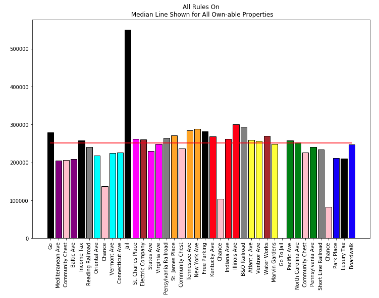
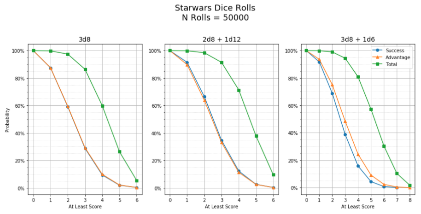
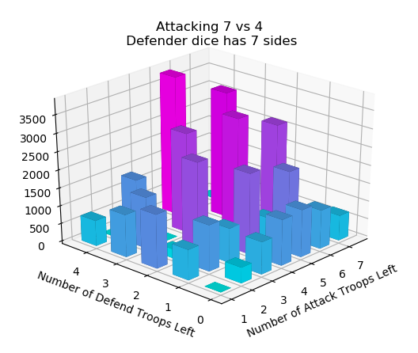

# Probability Playground

Welcome!

Included in this repo are several project playing with probability. Usually the questions revolve around answering a question about a game; "Should I do Option A? Or Option B instead?" Here we find the answers, and in the process explore some ways to visualize and interpret the results.

## <a href='https://github.com/ZacButko/Probability-Playground/tree/master/Dice%20Stats'>Dice Stats</a>

A simple dice roller for looking at how adding more dice-per-roll changes expected outcomes.

## <a href='https://github.com/ZacButko/Probability-Playground/tree/master/Monopoly'>Monopoly</a>

Investigation into how board mechancis from the classic board game 'Monopoly' affect probability of landing on various spaces.

## <a href='https://github.com/ZacButko/Probability-Playground/tree/master/Star%20Wars%20Dice'>Star Wars Dice</a>

The role playing game 'Star Wars' has special dice. Instead of having sides with numbers 1-N, they instead have two mechanics, "Success" and "Advantage", with varying prevalance on each die face.

In progressing one's character in the game the player has a choice, substitute one of three d8 dice for a d12, or add one d6 to your pool of three d8. We attempt to maximize for both mechanics then plot the results on an at-least graph.

## <a href='https://github.com/ZacButko/Probability-Playground/tree/master/Warfish%20Dice'>Warfish Dice</a>

The web-based game Warfish is much like the classic table-top "Risk". On your turn you wager your troops to attack other players' territories, conquering them for your empire. The attack mechanic is usually at the crux Warfish strategy, so maximizing it is imperative. We explore several ways to conceptualize remaining probability after successive losses (or wins!), and look at how this changes when defender has extra advantage (+1 or higher) to their rolls.
