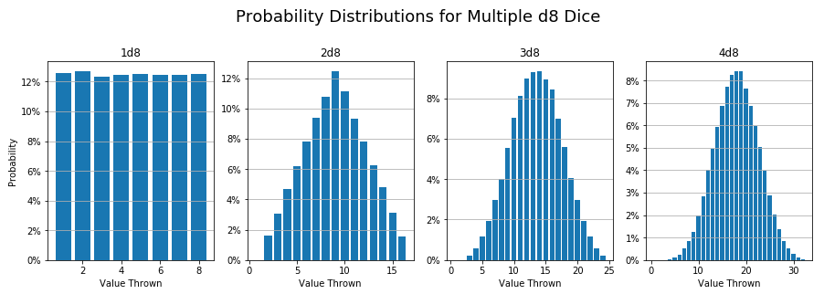

# Probability Playground

Welcome!

Included in this repo are several project playing with probability. Usually the questions revolve around answering a question about a game; "should I do this? or this other move instead?" Here we find the answers! and in the process look at some fun ways to visualize and interpret the results

## <a href='https://github.com/ZacButko/Probability-Playground/tree/master/Dice%20Stats'>Dice Stats</a>

A simple dice roller for looking at how adding more dice per roll changes expected outcomes

